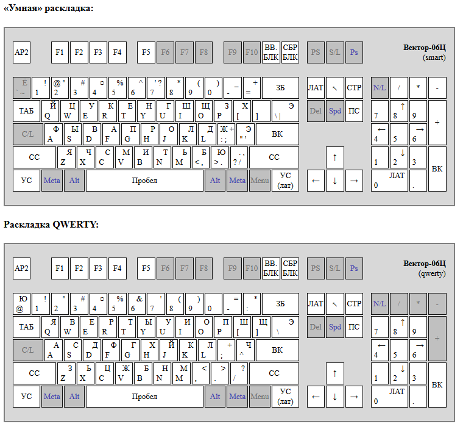
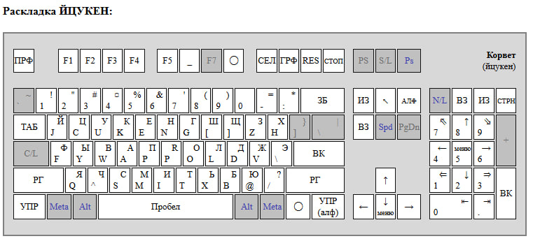

# Вектор-06Ц для Murmulator (порт Emu80 v4)

Специализированная прошивка эмулятора **Вектор-06Ц** для плат Murmulator на
микроконтроллере RP2040 (Raspberry Pi Pico) и RP2350 (Raspberry Pi Pico 2).

Поддерживается только сборка из корневого `CMakeLists.txt` через Pico SDK/CMake.
Техническое задание и журнал работ — в `vector06c_refactoring_plan.md`.

---

## Как выбрать прошивку (.uf2)

Имя файла кодирует плату, чип, частоту и способ вывода изображения:

```
<плата><чип>-v06c-<МГц>-<видео>-<версия>.uf2
```

**Плата (первые 2 символа):**

| Код  | Плата             |
|------|-------------------|
| `m1` | Murmulator 1.x    |
| `m2` | Murmulator 2.0    |
| `z0` | Waveshare PiZero  |
| `PC` | Olimex PICO-PC    |
| `DV` | Pimaronu Pico DV  |

**Чип:**

| Код  | Микроконтроллер  |
|------|------------------|
| `p2` | Pico 2 — RP2350  |
| `p1` | Pico — RP2040    |

**Способ вывода изображения:**

| Суффикс         | Выход                                                                 |
|-----------------|-----------------------------------------------------------------------|
| `VGA`           | Аналоговый VGA (резисторный ЦАП), 800×600                              |
| `HDMI-DVI`      | Цифровой HDMI/DVI через libdvi (PicoDVI), 800×600@60. Системная частота жёстко 400 МГц |
| `TV-SOFT-PAL`   | Программный композит **PAL** (RCA/«тюльпан») — для обычного телевизора |
| `TV-SOFT-NTSC`  | Программный композит **NTSC** (RCA/«тюльпан»)                          |
| `TV-RGB`        | Вывод на RGB[s] **PAL** (разводка, как у VGA). Системная частота жёстко 448 МГц |

**Примеры разбора имени:**

- `m1p2-v06c-400-HDMI-DVI-0.5.8.uf2` — Murmulator 1.x, Pico 2 (RP2350), 400 МГц, цифровой HDMI/DVI
- `m2p2-v06c-440-TV-SOFT-PAL-0.5.8.uf2` — Murmulator 2.0, Pico 2 (RP2350), 440 МГц, программный композит PAL
- `m1p2-v06c-440-TV-SOFT-NTSC-0.5.8.uf2` — Murmulator 1.x, Pico 2 (RP2350), 440 МГц, программный композит NTSC

### Что выбрать под свой монитор

- **VGA-монитор** → `VGA`.
- **HDMI-монитор/телевизор** → `HDMI-DVI` (частота при этом зафиксирована на 400 МГц).
- **Обычный телевизор по композиту** (RCA): для нашего стандарта — `TV-SOFT-PAL`; `TV-SOFT-NTSC` — если телевизор/монитор ждёт NTSC.

Плата (`m1`/`m2`) в имени файла должна совпадать с вашим железом.

---

## Установка

1. Зажмите кнопку **BOOTSEL** на Pico 2 и подключите плату по USB.
2. Появится накопитель `RP2350`.
3. Скопируйте на него нужный `.uf2` — плата перезагрузится сама.

---

## Управление и горячие клавиши

Главное меню открывается и закрывается клавишей **Alt**. Через меню доступны
загрузка файлов, монтирование дисков и все настройки, а пункты **Help** и
**About** показывают краткую справку по клавишам и сведения о сборке. Ниже —
работающие сочетания клавиш.

### Меню и система

| Клавиши            | Действие                                                        |
|--------------------|-----------------------------------------------------------------|
| `Alt`              | Открыть / закрыть главное меню                                  |
| `↑ ↓ ← →`          | Навигация по меню                                               |
| `Enter` / `Space`  | Выбрать / изменить пункт                                        |
| `Esc`              | Назад / закрыть меню                                            |
| **`Ctrl+Alt+Del`** | **Жёсткая перезагрузка устройства (watchdog).** Срабатывает всегда — даже при открытом меню или диалоге |
| `Alt+F11`          | Сброс (reset) эмулируемой машины                               |

### Файлы, диски, лента

| Клавиши          | Действие                                          |
|------------------|---------------------------------------------------|
| `Alt+L`          | Загрузить файл                                    |
| `Alt+F3`         | Загрузить и запустить                              |
| `Alt+A`          | Смонтировать образ в дисковод A                    |
| `Alt+B`          | Смонтировать образ в дисковод B                    |
| `Alt+F4`         | Подключить образ HDD                               |
| `Alt+E`          | Открыть RAM-диск (`Shift+Alt+E` — второй)          |
| `Alt+O`          | Сохранить RAM-диск как (`Shift+Alt+O` — второй)    |
| `Alt+T`          | Перехват ленты (tape redirect) вкл/выкл            |

### Снимки состояния (snapshots)

| Клавиши                | Действие                          |
|------------------------|-----------------------------------|
| `Left Win + F1…F12`    | Сохранить снимок в слот 1…12       |
| `Right Win + F1…F12`   | Загрузить снимок из слота 1…12     |

### Видео и раскладка

| Клавиши   | Действие                    |
|-----------|-----------------------------|
| `Alt+C`   | Цветной / чёрно-белый режим |
| `Alt+V`   | Обрезка до видимой области   |
| `Alt+Q`   | Раскладка QWERTY            |
| `Alt+J`   | Раскладка ЙЦУКЕН            |
| `Alt+K`   | «Умная» раскладка           |

#### Раскладки клавиатуры




### Сдвиг картинки на экране

Подстройка положения изображения под конкретный монитор/телевизор — цифровыми
клавишами на numpad. Настройка сохраняется отдельно для каждого режима вывода
(см. раздел «Настройки»).

| Клавиши        | Действие                                    |
|----------------|---------------------------------------------|
| Numpad `*` `/` | Сдвиг картинки по горизонтали (вправо/влево) |
| Numpad `+` `-` | Сдвиг картинки по вертикали (вниз/вверх)     |

Когда открыто главное меню, те же клавиши двигают **само меню** (чтобы оно и
файловый диалог не уезжали за пределы видимой области экрана).

### Джойстик / геймпад

Поддерживаются NES-совместимые геймпады. Кнопки отображаются на клавиши, в том
числе для навигации по меню:

| Кнопка геймпада | Клавиша    | Назначение                        |
|-----------------|------------|-----------------------------------|
| **Start**       | `Alt`      | Открыть / закрыть меню            |
| **Select**      | `Tab`      | —                                 |
| **A**           | `Space`    | Выбор в меню / огонь              |
| **B**           | `Enter`    | Выбор в меню                      |
| D-pad ↑↓←→      | стрелки    | Навигация по меню / направления   |

Таким образом всё меню проходится одним геймпадом: **Start** — открыть,
крестовина — навигация, **A**/**B** — выбрать.

---

## Настройки

Конфигурация хранится на SD-карте в `/.config/vector06c.cfg` и правится через
меню. Значения применяются при старте.

- **Смещение картинки (video offset).** Это подстройка конкретного устройства
  вывода, поэтому хранится раздельно для каждого режима — со своим префиксом
  ключа: `pal_`, `ntsc_`, `vga_`, `dvi_`. Одна SD-карта, переставляемая между
  разными прошивками, больше не смешивает подстройки разных экранов. Положение
  меню на экране считается от этого смещения, поэтому центрируется тоже
  раздельно.
- **Частота RP2350** (меню *System → RP2350 frequency*). Для VGA и композита
  доступны 400/440/480/520/540 МГц. Для `HDMI-DVI` частота зафиксирована на
  400 МГц (значение из конфига игнорируется — libdvi поддерживает строго одну
  частоту на разрешение).
- **Напряжение ядра** (меню *System → Core voltage*).

---

## Сборка

Нужен установленный Pico SDK. Проверено в VSCode + плагин Raspberry Pi Pico. Основные ключи задаются вверху `CMakeLists.txt` (или через -D в консольном режиме):

- Способ вывода: `SOFTTV` (+ опционально `TV_NTSC` для NTSC вместо PAL),
  `VGA_DRV` или `HDMI_DVI`.
- `CPU_MHZ` — системная частота (для `HDMI_DVI` принудительно 400).
- `PICO_BOARD` — плата (`murmulator` или `murmulator2`).

Готовый `.uf2` появляется в каталоге сборки (bin) под именем по схеме выше.

## Клавиши и назначения встроенного ПЗУ

Ниже описан именно встроенное в эту сборку ПЗУ Вектора.

### Управляющие клавиши Вектора

| Обозначение Вектора | Расшифровка | Клавиша PC в этой сборке | Назначение |
|---|---|---|---|
| `СС` | смена регистра | левый или правый `Shift` | верхний регистр и дополнительные символы |
| `УС` | управляющий символ | левый `Ctrl` | служебный модификатор, близкий по смыслу к `Ctrl` |
| `РУС/ЛАТ` | русский/латинский алфавит | правый `Ctrl`, `Insert`; также `Numpad 0`, когда numpad не занят джойстиком | переключение алфавита |

`СБР` и `БЛ` не заведены в обычную матрицу клавиатуры как две отдельные
PC-клавиши. Их аппаратный результат эмулируется специальными командами:

| Клавиша PC | Операция реального Вектора | Что делает эмулятор |
|---|---|---|
| `F11` | `ВВОД + БЛ` | сбрасывает машину и оставляет загрузочное ПЗУ подключённым |
| `F12` | `СБР + БЛ` | сбрасывает машину и отключает загрузочное ПЗУ, открывая RAM с адреса `0000h` |

Обычные `F1`…`F5` PC соответствуют одноимённым клавишам основной матрицы
Вектора. Для снимков состояния они используются только вместе с клавишами Win.

### Почему после `F12` запускается программа из RAM

При включённом ПЗУ чтение младших адресов идёт из ROM, а запись — в находящуюся
под ним RAM. Поэтому загрузчик может записать программу начиная с `0000h`, хотя
процессор пока продолжает видеть там ПЗУ.

`F12` выполняет reset и затем отключает ROM. После reset процессор начинает с
`0000h`, но теперь по этому адресу уже видна загруженная программа в RAM. Это и
есть аппаратный смысл сочетания `СБР + БЛ`.

### Какие клавиши опрашивает всроенный ROM

ПЗУ выбирает вторую строку матрицы (`FDh` в порт `03h`) и читает порт `02h`.
В этой строке находятся:

```text
HOME, CLEAR, ESC, F1, F2, F3, F4, F5
```

Получаемые активные-низкие коды:

| Клавиша | Код |
|---|---:|
| `HOME` | `FEh` |
| `CLEAR` | `FDh` |
| `ESC` | `FBh` |
| `F1` | `F7h` |
| `F2` | `EFh` |
| `F3` | `DFh` |
| `F4` | `BFh` |
| `F5` | `7Fh` |
| `F1+F2` | `E7h` |
| `F2+F3` | `CFh` |
| `F1+F3` | `D7h` |

ПЗУ отдельно читает линию `УС` через бит 6 порта `01h`. Поэтому часть функций
вызывается не одиночной F-клавишей, а с удержанием `УС` (`левый Ctrl` на PC).

### Пользовательские функции загрузочного ПЗУ

ПЗУ опрашивает F-клавиши только во время начального запуска. После появления
экрана с дискетой ROM уже перешёл в ветку FDD и обычные нажатия `F3`, `F4` или
другой клавиши выбора больше не проверяются.

Чтобы выбрать режим, клавишу нужно удерживать во время reset:

1. зажать нужную F-клавишу или сочетание;
2. не отпуская её, нажать `F11`;
3. после начала выбранной ветки отпустить клавиши.
4. нажать `F12` - стартовать выбранный режим из RAM

Эмулятор сохраняет состояние уже зажатых клавиш во время `F11`, поэтому ROM
видит их сразу после reset.

| Клавиши Вектора | Клавиши PC | Действие |
|---|---|---|
| `ВВОД + БЛ` | `F11` | холодный вход в начальный загрузчик с подключённым ROM |
| `СБР + БЛ` | `F12` | запуск уже загруженного кода из RAM; ROM отключается |
| `F1` при reset | удерживать `F1`, нажать `F11` | стандартная загрузка с магнитофонного входа; показывает экран-карту загрузки |
| `F2` при reset | удерживать `F2`, нажать `F11` | ищет внешнее загрузочное устройство через второй ВВ55 (`порты 04h–07h`); при отсутствии устройства переходит к магнитофонной загрузке |
| `ESC` при reset | удерживать `Esc`, нажать `F11` | загрузка через параллельный интерфейс на портах `05h/06h` |
| `F3` при reset | удерживать `F3`, нажать `F11` | копирует блок `08C5h…4289h` из ROM в RAM с `0100h` и передаёт ему управление |
| `F4` при reset | удерживать `F4`, нажать `F11` | копирует блок `428Bh…6ECAh` из ROM в RAM с `0100h` и передаёт ему управление |
| `F5` при reset | удерживать `F5`, нажать `F11` | копирует блок `6ECCh…72AFh` из ROM в RAM с `0100h` и передаёт ему управление |
| `F1+F2` при reset | удерживать `F1+F2`, нажать `F11` | запускает дисковый загрузчик ВГ93 |
| `F2+F3` при reset | удерживать `F2+F3`, нажать `F11` | запускает загрузчик устройства на портах `5Fh/57h` |
| `F1+F3` при reset | удерживать `F1+F3`, нажать `F11` | запускает загрузчик устройства через порты `04h–07h` |
| `CLEAR` при reset | удерживать соответствующую PC-клавишу, нажать `F11` | при наличии сигнатуры `JMP 9403h` по адресу `9400h` копирует блок `72B1h…738Ah` в `9300h` |

### Дисковый загрузчик ВГ93

Во встроенном ПЗУ присутствует полноценная ветвь загрузки с FDD:

- `18h` — регистр данных ВГ93;
- `19h` — регистр сектора;
- `1Ah` — регистр дорожки;
- `1Bh` — команда/состояние;
- `1Ch` — выбор дисковода и стороны.

Загрузчик:

1. проверяет наличие контроллера;
2. читает служебный сектор;
3. проверяет контрольную сумму;
4. считывает требуемые сектора в RAM;
5. формирует переход по адресу `0000h`.

При загрузке `.fdd` через `Alt+F3` эмулятор сначала даёт ROM время выполнить эту
дисковую процедуру, затем делает reset и отключает ROM. Поэтому фактический
старт кода с дискеты происходит после операции, эквивалентной `СБР + БЛ`.

### Встроенные блоки `УС+F3`, `УС+F4`, `УС+F5`

ROM содержит три крупных программных массива, которые копируются в RAM с
`0100h`. По одному только машинному коду загрузчика достоверно видны адреса и
размеры, но не пользовательские названия этих программ:

| Команда | Источник в ROM | Размер |
|---|---:|---:|
| `УС+F3` | `08C5h` | `39C5h` байт |
| `УС+F4` | `428Bh` | `2C40h` байт |
| `УС+F5` | `6ECCh` | `03E4h` байт |

После копирования возврат организован через адрес `0100h`.
